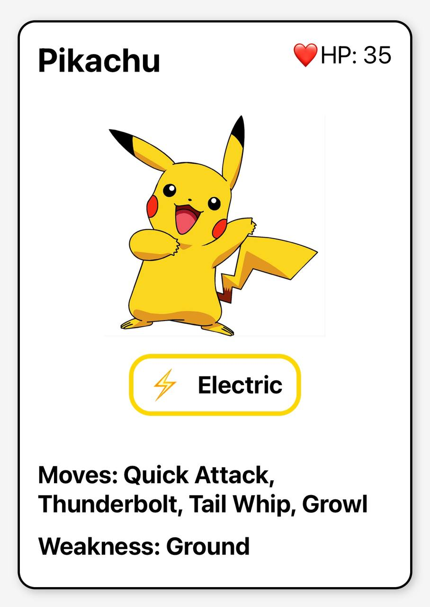

# POKEMON CARDS ⚡️

This is card with information of Pokemons.

I was using React Native

## PREVIEW



## INSTALLATION

```
git clone https://github.com/ksunwy/pokemon-cards.git

npm install

npm start
```